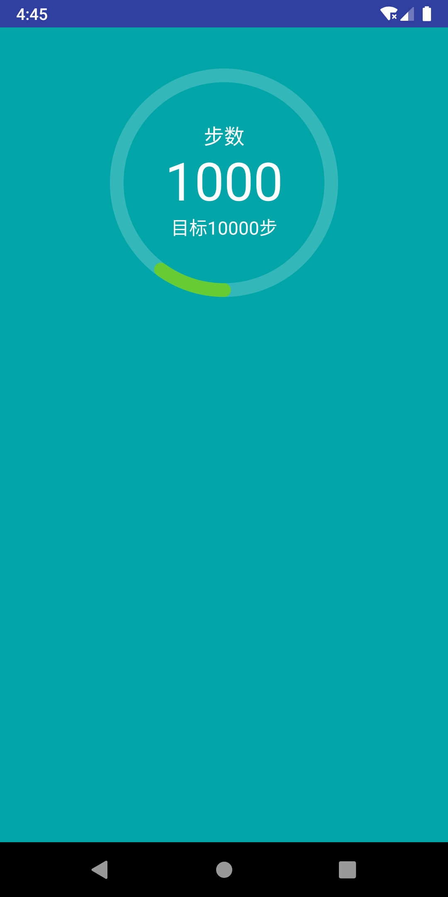
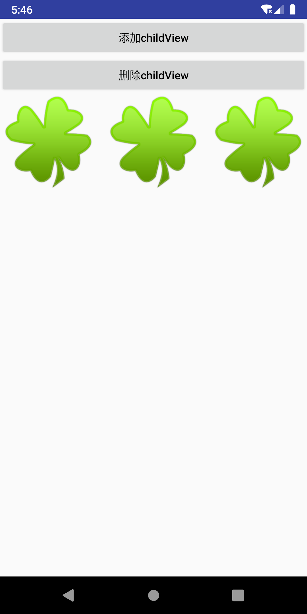
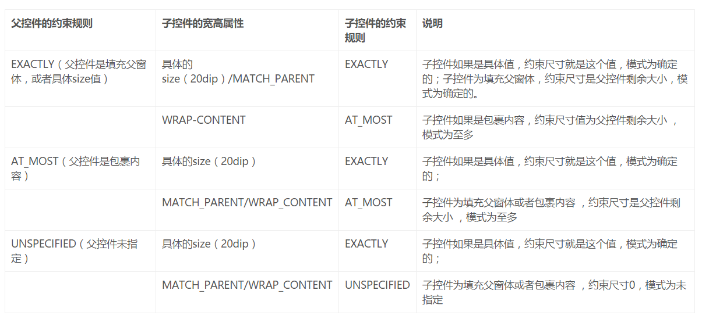

- [Android自定义控件](#android自定义控件)
  - [1. 继承自View](#1-继承自view)
    - [1. 自定义属性](#1-自定义属性)
    - [2. 继承View定义控件](#2-继承view定义控件)
    - [3. 使用自定义控件](#3-使用自定义控件)
  - [2. 继承自ViewGroup](#2-继承自viewgroup)
    - [1. 自定义属性](#1-自定义属性-1)
    - [2. 继承ViewGroup](#2-继承viewgroup)
    - [3. 在布局文件中添加布局](#3-在布局文件中添加布局)
    - [4. 在Activity中使用](#4-在activity中使用)
  - [3. 继承Android控件](#3-继承android控件)
  - [4. 组合控件](#4-组合控件)
  - [5. 需要注意点](#5-需要注意点)
## Android自定义控件

Android自定义控件一般分为四种情况，第一种是继承自View，第二种是继承自ViewGroup, 第三种是继承自已有Android控件，第四种是组合控件，即将一些已有的控件组合到一起，生成新的控件。这几种最简单的就是属于组合控件，就是简单的将一些控件通过一些布局参数添加到已有的父容器中，比如LinearLayout, RelativeLayout等，属于常规操作。剩下的几种比较复杂，第一种需要继承自View，然后一般会重写onMeasure(), onSizeChanged(), onDraw()方法，同时一般在构造器中需要一些常用属性的初始化，这些属性一般都定义在资源文件的attrs文件中。第二种继承自ViewGroup的一般要重写onMeasure(), onLayout(), onSizeChanged()方法。第三种继承自已有的Android控件，一般是要借助原有控件的一些功能特性，但是需要改造才能适应新的功能需求，需要重写一些原有的方法。除了以上的基本操作，只是绘制了UI，但是没有相关的交互操作或者动画效果，这些比较高级，交互操作需要和事件拦截和事件处理进行结合，动画则需要一些属性动画的配合才能显示效果。

### 1. 继承自View 
#### 1. 自定义属性
比如，我们自定义一个计步器控件，效果如下

首先在资源文件res/values/attrs.xml中定义属性
```java
<resources>
    <declare-styleable name="ArcProgress">
        <attr name="arc_progress" format="integer" />
        <attr name="arc_angle" format="float" />
        <attr name="arc_stroke_width" format="dimension" />
        <attr name="arc_max" format="integer" />
        <attr name="arc_unfinished_color" format="color" />
        <attr name="arc_finished_color" format="color" />
        <attr name="arc_text_size" format="dimension" />
        <attr name="arc_text_color" format="color" />
        <attr name="arc_suffix_text" format="string" />
        <attr name="arc_suffix_text_size" format="dimension" />
        <attr name="arc_suffix_text_padding" format="dimension" />
        <attr name="arc_bottom_text" format="string" />
        <attr name="arc_bottom_text_size" format="dimension" />
    </declare-styleable>
</resources>
```
#### 2. 继承View定义控件
继承自View, 需要重写onMeasure, onDraw方法，代码如下

```java
public class ArcProgress extends View {
    private static final String TAG = "ArcProgress";
    private Paint paint;
    protected Paint textPaint;
    private Paint innerPaint;

    private RectF rectF = new RectF();

    private float strokeWidth;
    private float suffixTextSize;
    private float bottomTextSize;
    private String bottomText;
    private float textSize;
    private int textColor;
    private int progress = 0;
    private int max;
    private int finishedStrokeColor;
    private int unfinishedStrokeColor;
    private float arcAngle;
    private String suffixText = "步";
    private float suffixTextPadding;

    private float innerRadius;
    private float cx;
    private float cy;

    private final int default_finished_color = Color.WHITE;
    private final int default_unfinished_color = Color.rgb(72, 106, 176);
    private final int default_text_color = Color.rgb(66, 145, 241);
    private final float default_suffix_text_size;
    private final float default_suffix_padding;
    private final float default_bottom_text_size;
    private final float default_stroke_width;
    private final String default_suffix_text;
    private final int default_max = 100;
    // 这里可以控制圆环的闭合度
    private final float default_arc_angle = 360 * 1.0f;
    private float default_text_size;
    private final int min_size;


    public ArcProgress(Context context) {
        this(context, null);
    }

    public ArcProgress(Context context, AttributeSet attrs) {
        this(context, attrs, 0);
    }

    public ArcProgress(Context context, AttributeSet attrs, int defStyleAttr) {
        super(context, attrs, defStyleAttr);

        default_text_size = DisplayUtil.sp2px(context, 18);
        min_size = (int) DisplayUtil.dp2px(context, 100);
        default_text_size = DisplayUtil.sp2px(context, 40);
        default_suffix_text_size = DisplayUtil.sp2px(context, 15);
        default_suffix_padding = DisplayUtil.dp2px(context, 4);
        default_suffix_text = "步";
        default_bottom_text_size = DisplayUtil.sp2px(context, 10);
        default_stroke_width = DisplayUtil.dp2px(context, 4);

        TypedArray attributes = context.getTheme().obtainStyledAttributes(attrs, R.styleable.ArcProgress, defStyleAttr, 0);
        initByAttributes(attributes);
        attributes.recycle();

        initPainters();
    }

    protected void initByAttributes(TypedArray attributes) {
        finishedStrokeColor = attributes.getColor(R.styleable.ArcProgress_arc_finished_color, default_finished_color);
        unfinishedStrokeColor = attributes.getColor(R.styleable.ArcProgress_arc_unfinished_color, default_unfinished_color);
        textColor = attributes.getColor(R.styleable.ArcProgress_arc_text_color, default_text_color);
        textSize = attributes.getDimension(R.styleable.ArcProgress_arc_text_size, default_text_size);
        arcAngle = attributes.getDimension(R.styleable.ArcProgress_arc_angle, default_arc_angle);
        setMax(attributes.getInt(R.styleable.ArcProgress_arc_max, default_max));
        setProgress(attributes.getInt(R.styleable.ArcProgress_arc_progress, 0));
        strokeWidth = attributes.getDimension(R.styleable.ArcProgress_arc_stroke_width, default_stroke_width);
        suffixTextSize = attributes.getDimension(R.styleable.ArcProgress_arc_suffix_text_size, default_suffix_text_size);
        suffixText = TextUtils.isEmpty(attributes.getString(R.styleable.ArcProgress_arc_suffix_text)) ? default_suffix_text : attributes.getString(R.styleable.ArcProgress_arc_suffix_text);
        suffixTextPadding = attributes.getDimension(R.styleable.ArcProgress_arc_suffix_text_padding, default_suffix_padding);
        bottomTextSize = attributes.getDimension(R.styleable.ArcProgress_arc_bottom_text_size, default_bottom_text_size);
        bottomText = attributes.getString(R.styleable.ArcProgress_arc_bottom_text);
    }

    protected void initPainters() {
        textPaint = new TextPaint();
        textPaint.setColor(textColor);
        textPaint.setTextSize(textSize);
        textPaint.setAntiAlias(true);

        paint = new Paint();
        paint.setColor(default_unfinished_color);
        paint.setAntiAlias(true);
        paint.setStrokeWidth(strokeWidth);
        paint.setStyle(Paint.Style.STROKE);
        // 这里的setStrokeCap是描边线帽的意思 也就是stroke的笔端的样式
        paint.setStrokeCap(Paint.Cap.ROUND);
    }

    @Override
    public void invalidate() {
        initPainters();
        super.invalidate();
    }

    public float getStrokeWidth() {
        return strokeWidth;
    }

    public void setStrokeWidth(float strokeWidth) {
        this.strokeWidth = strokeWidth;
        this.invalidate();
    }

    public float getSuffixTextSize() {
        return suffixTextSize;
    }

    public void setSuffixTextSize(float suffixTextSize) {
        this.suffixTextSize = suffixTextSize;
        this.invalidate();
    }

    public String getBottomText() {
        return bottomText;
    }

    public void setBottomText(String bottomText) {
        this.bottomText = bottomText;
        this.invalidate();
    }

    public int getProgress() {
        return progress;
    }

    public void setProgress(int progress) {
        this.progress = progress;
        // if (this.progress > getMax()) {
        // this.progress %= getMax();
        // }
        invalidate();
    }

    public int getMax() {
        return max;
    }

    public void setMax(int max) {
        if (max > 0) {
            this.max = max;
            invalidate();
        }
    }

    public float getBottomTextSize() {
        return bottomTextSize;
    }

    public void setBottomTextSize(float bottomTextSize) {
        this.bottomTextSize = bottomTextSize;
        this.invalidate();
    }

    public float getTextSize() {
        return textSize;
    }

    public void setTextSize(float textSize) {
        this.textSize = textSize;
        this.invalidate();
    }

    public int getTextColor() {
        return textColor;
    }

    public void setTextColor(int textColor) {
        this.textColor = textColor;
        this.invalidate();
    }

    public int getFinishedStrokeColor() {
        return finishedStrokeColor;
    }

    public void setFinishedStrokeColor(int finishedStrokeColor) {
        this.finishedStrokeColor = finishedStrokeColor;
        this.invalidate();
    }

    public int getUnfinishedStrokeColor() {
        return unfinishedStrokeColor;
    }

    public void setUnfinishedStrokeColor(int unfinishedStrokeColor) {
        this.unfinishedStrokeColor = unfinishedStrokeColor;
        this.invalidate();
    }

    public float getArcAngle() {
        return arcAngle;
    }

    public void setArcAngle(float arcAngle) {
        this.arcAngle = arcAngle;
        this.invalidate();
    }

    public String getSuffixText() {
        return suffixText;
    }

    public void setSuffixText(String suffixText) {
        this.suffixText = suffixText;
        this.invalidate();
    }

    public float getSuffixTextPadding() {
        return suffixTextPadding;
    }

    public void setSuffixTextPadding(float suffixTextPadding) {
        this.suffixTextPadding = suffixTextPadding;
        this.invalidate();
    }

    @Override
    protected int getSuggestedMinimumHeight() {
        return min_size;
    }

    @Override
    protected int getSuggestedMinimumWidth() {
        return min_size;
    }

    @Override
    protected void onMeasure(int widthMeasureSpec, int heightMeasureSpec) {
        // rectF当遇到画圆角的时候，需要将四个顶点的位置向缩画笔的1/2 
        rectF.set(strokeWidth / 2f, strokeWidth / 2f,
                MeasureSpec.getSize(widthMeasureSpec) - strokeWidth / 2f,
                MeasureSpec.getSize(heightMeasureSpec)
                        - strokeWidth / 2f);
        float radius = getWidth() / 2f;
        innerRadius = (float) (radius * 0.8);
        cx = getWidth() / 2;
        cy = getHeight() / 2;
        // float angle = (360 - arcAngle) / 2f;
        // arcBottomHeight = radius * (float) (1 - Math.cos(angle / 180 *
        // Math.PI));
        setMeasuredDimension(widthMeasureSpec, heightMeasureSpec);
    }

    @Override
    protected void onDraw(Canvas canvas) {
        super.onDraw(canvas);
        float startAngle = 270 - arcAngle / 2f; // 270 - 360/2= 90 90度对的正好是Y轴正下方
        float finishedSweepAngle = progress / (float) getMax() * arcAngle;
        if (this.progress > getMax()) {
            finishedSweepAngle = arcAngle;
        }
        Log.e(TAG, "onDraw: " + arcAngle);
        float finishedStartAngle = startAngle;
        paint.setColor(unfinishedStrokeColor);
        canvas.drawArc(rectF, startAngle, arcAngle, false, paint);
        paint.setColor(finishedStrokeColor);
        canvas.drawArc(rectF, finishedStartAngle, finishedSweepAngle, false, paint);

        String text = String.valueOf(getProgress());
        if (!TextUtils.isEmpty(text)) {
            textPaint.setColor(textColor);
            textPaint.setTextSize(textSize);
            if (isStopStep) {
                text = "暂停";
                textPaint.setTextSize(textSize / 2);
            }
            float textHeight = textPaint.descent() + textPaint.ascent();
            float textBaseline = (getHeight() - textHeight) / 2.0f;
            canvas.drawText(text, (getWidth() - textPaint.measureText(text)) / 2.0f, textBaseline, textPaint);

            textPaint.setTextSize(suffixTextSize);

            float suffixHeight = (float) ((getHeight() * 0.3) - (textPaint.descent() + textPaint.ascent()) / 2);
            canvas.drawText(suffixText, (getWidth() - textPaint.measureText(suffixText)) / 2.0f, suffixHeight, textPaint);
        }

        if (!TextUtils.isEmpty(getBottomText())) {
            textPaint.setTextSize(bottomTextSize);
            float bottomTextBaseline = (float) ((getHeight() * 0.7) - (textPaint.descent() + textPaint.ascent()) / 2);
            canvas.drawText(getBottomText(), (getWidth() - textPaint.measureText(getBottomText())) / 2.0f, bottomTextBaseline, textPaint);
        }
    }


    private boolean isStopStep = false;

    public void setStopStep(boolean isStopStep) {
        this.isStopStep = isStopStep;
        this.invalidate();
    }
}
```
#### 3. 使用自定义控件

```java
<?xml version="1.0" encoding="utf-8"?>
<RelativeLayout xmlns:android="http://schemas.android.com/apk/res/android"
    xmlns:gyw="http://schemas.android.com/apk/res-auto"
    xmlns:tools="http://schemas.android.com/tools"
    android:layout_width="match_parent"
    android:layout_height="match_parent"
    android:background="#00A5A8"
    android:paddingBottom="@dimen/activity_vertical_margin"
    android:paddingLeft="@dimen/activity_horizontal_margin"
    android:paddingRight="@dimen/activity_horizontal_margin"
    android:paddingTop="@dimen/activity_vertical_margin">

    <com.lucky.customviewlearn.canvas.ArcProgress
        android:id="@+id/arc_progress"
        android:layout_width="200dp"
        android:layout_height="200dp"
        android:layout_centerHorizontal="true"
        android:layout_marginTop="20dp"
        gyw:arc_bottom_text="目标10000步"
        gyw:arc_bottom_text_size="16dip"
        gyw:arc_finished_color="#65cd33"
        gyw:arc_max="10000"
        gyw:arc_stroke_width="12dip"
        gyw:arc_suffix_text="步数"
        gyw:arc_suffix_text_size="18dip"
        gyw:arc_text_color="#ffffff"
        gyw:arc_text_size="46dip"
        gyw:arc_unfinished_color="#33ffffff" />

</RelativeLayout>
```

### 2. 继承自ViewGroup
自定义一个ViewGroup, 类似于GridView, 效果如下：



#### 1. 自定义属性
在资源文件res/values/attrs.xml中定义自定义属性：

```java
<declare-styleable name="CustomGridView">
    <attr name="childHorizontalSpace" format="dimension" />
    <attr name="childVerticalSpace" format="dimension" />
    <attr name="columnNum" format="integer" />
</declare-styleable>
```
#### 2. 继承ViewGroup
```java
// CustomGridView
public class CustomGridView extends ViewGroup {
    private int childHorizontalSpace;
    private int childVerticalSpace;
    private int columnNum;
    private int childWidth;
    private int childHeight;

    public CustomGridView(Context context, AttributeSet attrs) {
        super(context, attrs);
        TypedArray attributes = context.obtainStyledAttributes(attrs, R.styleable.CustomGridView);
        childHorizontalSpace = attributes.getDimensionPixelSize(R.styleable.CustomGridView_childHorizontalSpace, 0);
        childVerticalSpace = attributes.getDimensionPixelSize(R.styleable.CustomGridView_childVerticalSpace, 0);
        columnNum = attributes.getInt(R.styleable.CustomGridView_columnNum, 0);
        attributes.recycle();
    }

    @Override
    protected void onMeasure(int widthMeasureSpec, int heightMeasureSpec) {
        super.onMeasure(widthMeasureSpec, heightMeasureSpec);
        int width = MeasureSpec.getSize(widthMeasureSpec);
        int height = MeasureSpec.getSize(heightMeasureSpec);
        int childCount = getChildCount();
        if (childCount > 0) {
            childWidth = (width - (columnNum - 1) * childHorizontalSpace) / columnNum;
            childHeight = childWidth;
            int innerWidth = width;
            if (childCount < columnNum) {
                innerWidth = childCount * (childHeight + childVerticalSpace);
            }
            int innerHeight = 0;
            int rowCount = childCount / columnNum + (childCount % columnNum == 0 ? 0 : 1);
            innerHeight = rowCount * childHeight + (rowCount > 0 ? rowCount - 1 : 0) * childVerticalSpace;
            setMeasuredDimension(innerWidth, innerHeight);
        }
    }

    @Override
    protected void onLayout(boolean changed, int l, int t, int r, int b) {
        int childCount = getChildCount();
        if (childCount > 0) {
            for (int index = 0; index < childCount; index++) {
                View child = getChildAt(index);
                int left = (index % columnNum) * (childWidth + childHorizontalSpace);
                int top = (index / columnNum) * (childHeight + childVerticalSpace);
                child.layout(left, top, left + childWidth, top + childHeight);
            }
        }
    }
}
```
#### 3. 在布局文件中添加布局
```java
<!--最简单一种添加布局动画方式 animateLayoutChanges="true"-->
<?xml version="1.0" encoding="utf-8"?>
<LinearLayout xmlns:android="http://schemas.android.com/apk/res/android"
    xmlns:app="http://schemas.android.com/apk/res-auto"
    android:layout_width="match_parent"
    android:layout_height="match_parent"
    android:orientation="vertical">
    <Button
        android:id="@+id/btn_add_childView"
        android:layout_width="match_parent"
        android:layout_height="wrap_content"
        android:text="添加childView" />
    <Button
        android:id="@+id/btn_delete_childView"
        android:layout_width="match_parent"
        android:layout_height="wrap_content"
        android:text="删除childView" />
    <!--最简单一种添加布局动画方式 animateLayoutChanges="true"-->
    <com.lucky.customviewlearn.canvas.CustomGridView
        android:id="@+id/custom_gridview"
        android:layout_width="match_parent"
        android:layout_height="300dp"
        android:animateLayoutChanges="true"
        app:childHorizontalSpace="10dp"
        app:childVerticalSpace="10dp"
        app:columnNum="3" />
</LinearLayout>
```
#### 4. 在Activity中使用
```java
public class CustomGridViewActivity extends AppCompatActivity {
    @BindView(R.id.custom_gridview)
    CustomGridView customGridView;

    @Override
    protected void onCreate(@Nullable Bundle savedInstanceState) {
        super.onCreate(savedInstanceState);
        setContentView(R.layout.activity_custom_gridview);
        ButterKnife.bind(this);
        initView();
    }

    private void initView() {
        ImageView imageView = new ImageView(this);
        imageView.setImageResource(R.drawable.ic_leaf);
        customGridView.addView(imageView);
        //addAnimations(customGridView);
        //addLayoutAnimations(customGridView);
    }

    @OnClick(R.id.btn_add_childView)
    public void onAddChildViewClick(View view) {
        ImageView imageView = new ImageView(this);
        imageView.setImageResource(R.drawable.ic_leaf);
        customGridView.addView(imageView, 0);
    }


    @OnClick(R.id.btn_delete_childView)
    public void onDeleteChildViewClick(View view) {
        if (customGridView.getChildCount() > 0) {
            customGridView.removeViewAt(0);
        }
    }

    /**
     * LayoutTransition 提供了以下几种过渡类型：
     * APPEARING —— 元素在容器中显现时需要动画显示。
     * CHANGE_APPEARING —— 由于容器中要显现一个新的元素，其它元素的变化需要动画显示。
     * DISAPPEARING —— 元素在容器中消失时需要动画显示。
     * CHANGE_DISAPPEARING —— 由于容器中某个元素要消失，其它元素的变化需要动画显示。
     */
    public void addAnimations(ViewGroup viewGroup) {
        LayoutTransition mLayoutTransition = new LayoutTransition();
        //设置每个动画持续的时间
        mLayoutTransition.setStagger(LayoutTransition.CHANGE_APPEARING, 50);
        mLayoutTransition.setStagger(LayoutTransition.CHANGE_DISAPPEARING, 50);
        mLayoutTransition.setStagger(LayoutTransition.APPEARING, 50);
        mLayoutTransition.setStagger(LayoutTransition.DISAPPEARING, 50);

        PropertyValuesHolder appearingScaleX = PropertyValuesHolder.ofFloat("scaleX", 0.5f, 1.0f);
        PropertyValuesHolder appearingScaleY = PropertyValuesHolder.ofFloat("scaleY", 0.5f, 1.0f);
        PropertyValuesHolder appearingAlpha = PropertyValuesHolder.ofFloat("alpha", 0f, 1f);
        ObjectAnimator mAnimatorAppearing = ObjectAnimator.ofPropertyValuesHolder(this, appearingAlpha, appearingScaleX, appearingScaleY);
        //为LayoutTransition设置动画及动画类型
        mLayoutTransition.setAnimator(LayoutTransition.APPEARING, mAnimatorAppearing);

        PropertyValuesHolder disappearingAlpha = PropertyValuesHolder.ofFloat("alpha", 1f, 0f);
        PropertyValuesHolder disappearingRotationY = PropertyValuesHolder.ofFloat("rotationY", 0.0f, 90.0f);
        ObjectAnimator mAnimatorDisappearing = ObjectAnimator.ofPropertyValuesHolder(this, disappearingAlpha, disappearingRotationY);
        //为LayoutTransition设置动画及动画类型
        mLayoutTransition.setAnimator(LayoutTransition.DISAPPEARING, mAnimatorDisappearing);

        ObjectAnimator mAnimatorChangeDisappearing = ObjectAnimator.ofFloat(null, "alpha", 1f, 0f);
        //为LayoutTransition设置动画及动画类型
        mLayoutTransition.setAnimator(LayoutTransition.CHANGE_DISAPPEARING, mAnimatorChangeDisappearing);
        ObjectAnimator mAnimatorChangeAppearing = ObjectAnimator.ofFloat(null, "alpha", 1f, 0f);
        //为LayoutTransition设置动画及动画类型
        mLayoutTransition.setAnimator(LayoutTransition.CHANGE_APPEARING, mAnimatorChangeAppearing);
        //为mImageViewGroup设置mLayoutTransition对象
        viewGroup.setLayoutTransition(mLayoutTransition);
    }

    private void addLayoutAnimations(ViewGroup viewGroup) {
        AlphaAnimation alphaAnimation = new AlphaAnimation(0.0f, 1.0f);
        alphaAnimation.setDuration(2000);
        LayoutAnimationController animationController = new LayoutAnimationController(alphaAnimation, 0.5f);
        animationController.setOrder(LayoutAnimationController.ORDER_NORMAL);
        viewGroup.setLayoutAnimation(animationController);
    }
}
```

### 3. 继承Android控件
对于现有的Android控件进行继承，可能是对事件分发进行逻辑拦截操作，一种可能是对现有的功能扩展。
常见的操作有比如对ViewPager禁止滑动，代码如下：
```java
public class ScrollViewPager extends ViewPager {

    public ScrollViewPager(Context context) {
        super(context);
    }

    public ScrollViewPager(Context context, AttributeSet attrs) {
        super(context, attrs);
    }

    private boolean canScroll;

    public void setCanScroll(boolean canScroll){
        this.canScroll = canScroll;
    }

    @Override
    public boolean onInterceptTouchEvent(MotionEvent ev) {
        if (canScroll) {
            return super.onInterceptTouchEvent(ev);
        }
        // 返回false 根据前面的总结可以知道，就是不拦截事件，那么响应的事件就不能发送到onTouchEvent
        // 方法中进行处理，就不能处理滑动操作，结果就是ViewPager滑不动，只能将事件发送到子控件中，比如列表
        // 中就可以接受到这个事件，进行垂直方向的滑动。
        // 返回super.onInterceptTouchEvent(ev) 就是将事件交给ViewPager已经定义好的事件拦截处理方法里，交给父类操作。
        // 注意：如果只是需要不滑动，那么就只需要重写OnInterceptTouchEvent并返回false即可，但是如果是可控制的，那么还需要根据情况调用父类原有的拦截事件处理方法。
        return false;
    }

    // 下面的语句其实是不必写的，如果拦截事件返回false 那么onTouchEvent事件是不会调用的，如果拦截事件
    // 调用了super.onInterceptTouchEvent(), 那么就会回调onTouchEvent()方法。
    @Override
    public boolean onTouchEvent(MotionEvent ev) {
        if (canScroll){
            return super.onTouchEvent(ev);
        }
        return false;
    }

}
```
总结：
事件的传递不会因为中间层是Fragment还是View就改变事件分发过程，比如ViewPager嵌套ListView和ViewPager嵌套Fragment列表，Fragment又含有ListView，两者都是事件从ViewPager传递到ListView, Fragment不影响事件的传递。比如ViewPager对事件进行了拦截，两种情况下，列表List都不会滑动。

### 4. 组合控件
组合控件比较简单，一般都是用一个类先继承一个LinearLayout, 或者是一个RelativeLayout, 然后在该类的构造方法中添加想要添加的View, 但是要注意添加的使用的布局参数，LayoutParams, 添加到不同的父布局里，使用的布局参数是不一样的。LinearLayout使用的是LinearLayout.LayoutParams, 有gravity, weight属性，这两个在添加子View的时候比较常用。RelativeLayout使用的是RelativeLayout.LayoutParams，一般要注意addRule方法，可以确定要添加的子View在父布局中的位置。两者除了自身的特有属性和方法之外，一般也有Margin属性也比较常用。

```java
TextView tvCancel = new TextView(this);
tvCancel.setText("取消");
RelativeLayout.LayoutParams cancelRelativeParams = new RelativeLayout.LayoutParams(ViewGroup.LayoutParams.WRAP_CONTENT, ViewGroup.LayoutParams.WRAP_CONTENT);
cancelRelativeParams.addRule(RelativeLayout.ALIGN_PARENT_TOP);
cancelRelativeParams.addRule(RelativeLayout.ALIGN_PARENT_RIGHT);
cancelRelativeParams.topMargin = 0;
cancelRelativeParams.rightMargin = 0;
addView("fixed", tvCancel, cancelRelativeParams);
```

### 5. 需要注意点
一般需要注意的点就是onMeasure的方法的使用，onMeasure方法里的两个参数是由父容器和子控件的布局参数来一起决定的，但是真正决定子控件的大小，是交给子控件来决定的，我们最终可以调用super.onMeasure(widthSpec, heightSpec)来交由父类来决定，但是在一些情况下有问题，也可以由子控件来决定 setMeasuredDimension(widht, height); 一般情况下，如果只考虑子控件的match_parent和exact_size这种情况，那么一般也不用重写onMeasure()方法，交给父类来处理就可以了，但是如果要考虑到wrap_content这种情况，那么就需要考虑下真实的大小情况，比如测量子控件的大小或者自己设定一个指定的大小，否则就按照系统的测量结果来搞了，一般不会得到想要的结果。具体的情况就是wrap_content,对于一般的自定义控件，如果不做处理，那么最终的大小就是和父容器的大小一样了，这个和本意wrap_content包裹内容不一致了。

最后的称述：
测量控件大小是父控件发起的
父控件要测量子控件大小，需要重写onMeasure方法，然后调用measureChildren或者measureChildWithMargins方法，View的onMeasure方法的参数是通过getChildMeasureSpec生成的，如果我们自定义控件需要使用wrap_content属性,我们需要重写onMeasure方法
测量控件的步骤：
父控件onMeasure->measureChildren/measureChildWithMargin->getChildMeasureSpec-> 子控件的measure->onMeasure->setMeasureDimension->父控件onMeasure结束调用setMeasureDimension，最后保存自己的大小


